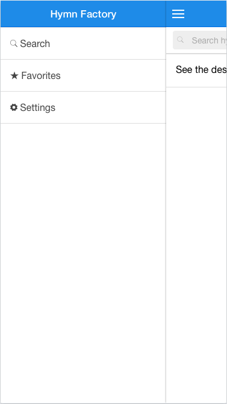

# Hymn Factory



 &nbsp;


## Why its awesome
This is a community maintained project. Built on top of Yeoman, Gulp, Bower, AngularJS, Ionic & of course Cordova.

## Contributing
There are two ways to contribute to this project.
  1. Maintaining the song database 
  2. App development
  
### Maintaining the song database
The whole song database is located in the `db` directory. Modifications/Additions can be done via pull requests. The only requirement is that the same standard and formatting is following. See the song specification section for details on this (TODO), or look at existing songs.

### App development
Since this is a community effort, the whole architecture is built around the github ecosystem. 


    
The API is a simple wrapper for the github API. Since the github API requires authentication, I've wrapped the db endpoints in the API which the App can interact with. This is simple express server and its located in the `server` directory.

**Note:** When developing locally, a local server can be run

#### Developing locally

##### Prerequisites
- Installation and **fair knowledge** of:
- node & npm - http://nodejs.org/download/
  - yo: `npm install --global yo` - http://yeoman.io/
  - gulp: `npm install --global gulp` - http://gulpjs.com/
  - bower: `npm install --global bower` - http://bower.io/
- In order to run your app on a device, you'll need:
  - **Platform SDKs** for the ones you are developing for. Head over to cordova documentation: [Platform Guides](http://cordova.apache.org/docs/en/edge/guide/platforms/index.html) or cordova cli: [Requirements](https://github.com/apache/cordova-cli/#requirements)

### Running locally

```sh
gulp watch --env=prod
```

This will build the app and open it up in the browser.

#### Options
```
--env
```

The environment to use. See `app/main/constants` for the environments available. Setting this to `prod` will use the published HymnFactory API from heroku. In most cases this should be fine. You would only need to use a local API if you'd like to make some changes to the API and need to run the server locally

```
--force-build
```

This will skip the linting of your code. Before commiting the code, however, you should run it once with the linter on.

### Testing
```sh
gulp karma
```

and 

```
gulp protractor
```

## License
Licensed under the MIT License
